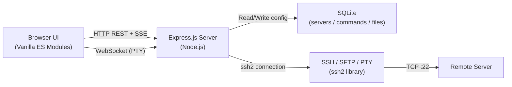
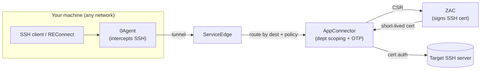

# Reconnect — Browser-Based SSH Manager

> **What is Reconnect?**
> Reconnect is a self-hosted, browser-based SSH manager that lets you connect to remote servers, run commands, manage files, and monitor system stats — all without installing a native SSH client. Open a tab, log in, and you're in. Every credential is AES-256 encrypted at rest; sessions stay server-side so nothing sensitive ever touches your local disk.

---

## Key Features

- **OTP / zero-trust authentication (default)** — Passcode-per-login through the org's ZAC certificate-based zero-trust gateway. Legacy password/private-key auth remains as a fallback but is being phased out. See [Authentication & Zero-Trust Flow](#authentication--zero-trust-flow).
- **Multi-server management** — Add, edit, and delete SSH servers; switch the global auth flow (OTP / legacy) in Settings.
- **Interactive terminal** — A full xterm.js PTY in legacy mode; a **command console** in OTP mode (the zero-trust gateway permits one interactive shell per login, so full-screen TUIs like `vim`/`htop` aren't available in-app — use a real `ssh` session for those).
- **Saved (Quick) Commands** — Store frequently-used commands and replay them in one click.
- **Ad-hoc command streaming** — Run one-off commands with live output streamed via Server-Sent Events.
- **Resizable output panel** — Drag the split between terminal and output log to suit your workflow.
- **Remote file browser + editor** — Navigate, upload, create, edit, and delete files with a Monaco-powered editor. Backed by SFTP in legacy mode, or tunnelled through the single shell (base64) in OTP mode.
- **Bookmarks** — Pin frequently accessed remote paths for instant navigation.
- **Server Overview** — Live bento-style dashboard showing CPU, memory, disk, load, uptime, and OS info.
- **Theme toggle** — Switch between dark and light themes instantly.
- **Responsive design** — Fully usable on mobile viewports with a collapsible rail and bottom navigation bar.
- **Settings** — Switch the global authentication flow (OTP vs legacy) and manage the application-level login password.

---

## Architecture at a Glance



- **Browser → Express**: REST API for CRUD operations; Server-Sent Events for streaming command output; WebSocket for interactive PTY.
- **Express → SSH**: The `ssh2` library manages connections, SFTP channels, and PTY allocation.
- **SQLite**: Stores server configurations (encrypted credentials), saved commands, and bookmarked file paths via `better-sqlite3`.
- **Encryption**: Credentials are encrypted with AES-256-GCM before being written to the database.

**In OTP mode**, the path to the server differs: REConnect tunnels through the local **zero-trust agent** (`0Agent → ServiceEdge → AppConnector → ZAC-signed cert → target`) instead of connecting directly, and multiplexes terminal + files + system-info over a **single interactive shell** (the gateway refuses extra channels and the SFTP/exec subsystems). See [Authentication & Zero-Trust Flow](#authentication--zero-trust-flow).

---

## Getting Started

### Prerequisites
- Node.js 18 or later
- An SSH server to connect to

### Installation

```bash
# Clone the repository
git clone <repo-url>
cd reconnect

# Install dependencies
npm install

# (Optional) Set an application password
echo "APP_PASSWORD=your-secret" > .env

# Start the server
npm start
# → Listening on http://127.0.0.1:9898
```

### First Run

Open `http://127.0.0.1:9898` in your browser.

> **Development tip**: If `APP_PASSWORD` is **not** set in your `.env` (or environment), the application **skips the login screen entirely** and loads the main UI directly. This makes local development frictionless — just `npm start` and go. Set `APP_PASSWORD` before exposing the app to any network.

### Running with PM2 (Auto-Start)

PM2 keeps Reconnect running in the background and restarts it automatically after crashes or reboots.

#### Common PM2 commands

| Command | What it does |
|---|---|
| `pm2 status` | See if Reconnect is running |
| `pm2 logs reconnect` | Tail live logs |
| `pm2 restart reconnect` | Restart the server |
| `pm2 stop reconnect` | Stop the server |
| `pm2 start npm --name reconnect -- start` | Start it again if stopped |

> **First-time setup** (if PM2 is not yet configured):
> ```bash
> npm install -g pm2
> pm2 start npm --name reconnect -- start
> pm2 save
> pm2 startup   # run the printed sudo command to enable auto-start on login
> ```

---

## Feature Walkthrough

### 1 — Login

| Desktop | Mobile |
|---------|--------|
|  |  |

If you have configured `APP_PASSWORD`, Reconnect shows a simple login form on first visit. Enter the password and click **Login** to reach the main UI. The session is cookie-based and automatically validated on every request.

> **No `APP_PASSWORD` set?** The login screen is bypassed automatically and the app shell loads directly — ideal for local development.

---

### 2 — App Shell & Sidebar

| Desktop | Mobile |
|---------|--------|
|  |  |

The main shell consists of:
- **Left rail** — icon strip with buttons for Settings, theme toggle, and (in connected state) tab navigation.
- **Sidebar** — scrollable list of all saved SSH servers. Each server shows its label, host, and a live status dot once connected.
- **Main panel** — content area that renders Overview, Terminal, or Files depending on the active tab.

On mobile, the sidebar collapses behind a menu toggle and a bottom navigation bar handles tab switching.

---

### 3 — Managing Servers (Add / Edit / Delete)

| Desktop | Mobile |
|---------|--------|
|  |  |

Click the **＋** button in the sidebar header to open the **Add Server** modal. Fill in:

| Field | Description |
|---|---|
| Label | Friendly display name |
| Host | IP address or hostname |
| Port | Default `22` |
| Username | SSH login user |
| Auth mode | Password / Private key / OTP |

Switch between auth tabs to reveal the relevant credential field. Click **Save** to persist the server (credentials are encrypted with AES-256-GCM).

| Desktop | Mobile |
|---------|--------|
|  |  |

To **edit** an existing server, hover its row and click the pencil icon — the same form opens pre-populated. Delete via the trash icon with a confirmation prompt.

---

### 4 — Settings

| Desktop | Mobile |
|---------|--------|
|  |  |

Open Settings via the **⚙** icon in the rail. From here you can:
- Switch the global authentication flow between **OTP (default)** and **Legacy (password/key)**. **OTP is the recommended default; legacy is a fallback that is being phased out and will be removed in a future release.** Changing the flow drops pooled sessions so each server re-authenticates under the new flow.
- Manage the application-level login password (`APP_PASSWORD`).

See [Authentication & Zero-Trust Flow](#authentication--zero-trust-flow) for how OTP works and what it changes about the Terminal and Files tabs.

---

### 5 — Server Overview: Before & After Connection

Reconnect distinguishes between a **selected** server (just clicked in the sidebar) and a **connected** server (active SSH session established).

#### Before Connection (Disconnected State)

| Desktop | Mobile |
|---------|--------|
|  |  |

When you first select a server, the Overview tab shows the server details with a **Connect** button. No live stats are visible yet — the SSH connection hasn't been established.

#### After Connection (Live Stats)

| Desktop | Mobile |
|---------|--------|
|  |  |

Click **Connect** (or the connect button in the toolbar). Reconnect establishes the SSH session and the bento dashboard lights up with live data:

- **Status pill** — green Connected indicator.
- **Hostname & OS** — distribution, kernel version.
- **Uptime** — human-readable running time.
- **CPU** — model and current load percentage.
- **Load Average** — 1 / 5 / 15-minute averages.
- **Memory** — used / total with a progress bar.
- **Disk** — root partition usage with a progress bar.

Stats refresh automatically on connection; no manual polling needed.

---

### 6 — Interactive Terminal

#### Connected State

| Desktop | Mobile |
|---------|--------|
|  |  |

The **Terminal** tab behaves differently depending on the auth flow:

- **Legacy mode** — a full PTY session via WebSocket: colour rendering, cursor control, scrollback, automatic resize, and full keyboard pass-through (Ctrl-C, Ctrl-Z, tab completion, etc.).
- **OTP mode** — a **command console**: type a command and press Enter, see its output, with command history (↑/↓), a working-directory-aware prompt, and Ctrl-C to cancel. Because the zero-trust gateway grants only one interactive shell per login, there is no live PTY here — full-screen programs (`vim`, `htop`, `less`) won't render. Use a real `ssh` session for those. (See [Authentication & Zero-Trust Flow](#authentication--zero-trust-flow).)

#### Running a Command

| Desktop | Mobile |
|---------|--------|
|  |  |

Type any shell command directly in the terminal and press **Enter**. The output streams back in real time through the WebSocket PTY — exactly as if you were using a native SSH client. The screenshot above shows `uptime` returning live server data.

---

### 7 — Quick Commands Drawer

| Desktop | Mobile |
|---------|--------|
|  |  |

Click the **⚡ Quick Commands** button in the terminal toolbar to open the drawer. Saved commands are listed with their labels. Click any row to inject the command into the active terminal and execute it immediately — no typing required.

To **add** a new quick command, use the inline form at the bottom of the drawer; to **delete**, click the × on any row. Commands are stored in SQLite and persist across sessions.

---

### 8 — Resizable Output / Log Panel

| Desktop | Mobile |
|---------|--------|
|  |  |

The terminal and output panel share a vertical split. Drag the **divider handle** between them to resize either region. Reconnect saves your preferred ratio in `localStorage` so it persists across page reloads.

The output panel is also used for streaming ad-hoc command results via Server-Sent Events — keeping one-off command output separate from your interactive PTY session.

---

### 9 — Remote File Browser

| Desktop | Mobile |
|---------|--------|
|  |  |

The **Files** tab shows a tree-style directory listing of the remote server. Navigate by:
- Clicking any **folder** row to expand/collapse it.
- Using the **breadcrumb bar** at the top to jump to any ancestor directory.
- Clicking the **pencil icon** next to the path to type a path directly and press Enter to navigate there.
- Clicking the **🔄 refresh** button to re-fetch the current directory.

> **Auth flow note:** In **legacy mode** the listing and all file operations use **SFTP**. In **OTP mode** the zero-trust gateway blocks the SFTP subsystem, so REConnect performs the same operations (list, read, edit/save, upload, delete) by running shell commands over the single interactive shell, moving file contents as **base64**. The experience is the same; very large or binary transfers are slower than SFTP. When not connected, the tab shows a **Connect** button instead of an error.

---

### 10 — Viewing a File

| Desktop | Mobile |
|---------|--------|
|  |  |

Click any **file** row in the tree to open it in the embedded **Monaco editor** (the same engine that powers VS Code). Features:
- Syntax highlighting for hundreds of languages (auto-detected from file extension).
- Find / replace, multi-cursor, bracket matching.
- **Save to Remote** button writes the current buffer back to the server via SFTP.
- **Download** button saves a local copy without touching the remote file.
- **Compile** button runs `sh compile.sh <filename>` in the `source_compile` directory on the remote server and streams the build output directly to the output panel.

> **Note:** Compile should be done after saving, and only when new changes have been applied.

---

### 11 — Creating a New File

| Desktop | Mobile |
|---------|--------|
|  |  |

Click the **+ New File** button in the Files toolbar. A prompt asks for the filename; the new file is created in the **current directory** shown in the path bar and opens immediately in Monaco for editing. Press **Save** to write the initial content to the remote server via SFTP.

---

### 12 — Deleting a File

| Desktop | Mobile |
|---------|--------|
|  |  |

With a file open in Monaco, click the **🗑 Delete** button in the toolbar. A confirmation modal appears before any action is taken — click **OK** to permanently remove the file from the remote server, or **Cancel** to abort. After deletion, the file tree automatically refreshes.

---

### 13 — Upload a File

| Desktop | Mobile |
|---------|--------|
|  |  |

Click the **↑ Upload** button in the Files toolbar to open a native file picker. Select a local file; Reconnect uploads it to the **current directory** shown in the path bar via SFTP. No temporary files are created server-side; the upload streams directly to the destination path.

---

### 14 — Bookmarks

| Desktop | Mobile |
|---------|--------|
|  |  |

With any file or directory open, click the **🔖 Bookmark** button to save the path. Open the **Bookmarks drawer** (toggle button in the Files toolbar) to see all saved paths as chips. Click any chip to navigate directly to that path in the file tree — ideal for deep config directories you access repeatedly.

Bookmarks are stored in SQLite and persist across sessions. Click the **×** on a chip to remove a bookmark.

---

### 15 — Theme Toggle

**Dark mode** (default):

| Desktop | Mobile |
|---------|--------|
|  |  |

**Light mode**:

| Desktop | Mobile |
|---------|--------|
|  |  |

Click the **🌙 / ☀** icon in the left rail to switch themes instantly. The preference is stored in `localStorage` and persists across page reloads.

---

### 16 — Responsive Design

Every feature shown above has been tested at both **1440 × 900 px** (desktop) and **390 × 844 px** (iPhone 14 equivalent). Reconnect adapts with:

- **Collapsible sidebar** — on narrow viewports the server list slides in from the left via a menu toggle.
- **Bottom navigation bar** — replaces the left rail for Overview / Terminal / Files tab switching on mobile.
- **Reflowing panels** — modals, the file tree, Monaco editor, and output panels all reflow to fill available width.
- **Touch-friendly targets** — buttons and rows use generous tap areas for reliable touch interaction.

All mobile screenshots in this document were captured at 390 × 844 px with a Mobile Safari user-agent.

---

## Security Notes

| Concern | How Reconnect addresses it |
|---|---|
| Credential storage | SSH passwords and private keys are encrypted with **AES-256-GCM** before being written to SQLite. The encryption key is derived from a `.secret` file generated on first run. |
| Application access | Protected by `APP_PASSWORD`; all routes check a signed session cookie. In development, omitting `APP_PASSWORD` bypasses the login screen for convenience. |
| Network exposure | Server binds to `127.0.0.1` by default — not reachable from other machines unless you explicitly change `HOST`. |
| Session management | Sessions are signed with a random key; tampering with the cookie invalidates it immediately. |
| SFTP operations | File reads and writes go through the SSH connection — no additional ports need to be opened. |
| Zero-trust (OTP) | In OTP mode there is **no stored credential** — access is gated per-login by an emailed one-time passcode through the ZAC zero-trust path, and traffic is restricted to a single interactive shell with SFTP/SCP/port-forwarding blocked at the gateway. |

---

## Authentication & Zero-Trust Flow

REConnect supports two authentication flows. **OTP is the default and recommended flow; the legacy password/key flow is a fallback that is being phased out and will be removed in a future release.** Switch the global flow in **Settings (⚙)**.

### Why OTP is different

The organization's SSH access is **password-less and certificate-based** through a zero-trust gateway (ZAC). You never store or type a server password — an **emailed one-time passcode (OTP)** authorizes each login, and a short-lived ZAC-signed SSH certificate (never leaving the gateway) connects you to the target.



**Connection flow (what you experience):**

1. You click **Connect**; the SSH session is intercepted by **0Agent** and tunnelled via **ServiceEdge** to the **AppConnector** in the target DC.
2. The AppConnector enforces **department/access policy**, then issues an **OTP prompt** (REConnect shows a passcode modal).
3. You enter the OTP from your **Zoho email**. The AppConnector obtains a ZAC-signed certificate and opens a certificate-authenticated session to the target server.
4. All your SSH traffic is proxied through this tunnel.

**The gateway restricts the session** — these SSH features are blocked at the zero layer (even if enabled on the target): **SFTP, SCP, port forwarding, Unix-socket forwarding, X11 forwarding, agent forwarding**. Only an **interactive shell** is allowed, and the gateway grants **one session channel per login**.

### What that changes in REConnect (OTP mode)

| Capability | Legacy mode | OTP mode |
|---|---|---|
| Connect | Direct, stored password/key | Tunnel + emailed OTP (no stored credential) |
| Terminal | Live PTY (xterm) — vim/htop work | **Command console** (run → output); no full-screen TUIs in-app |
| Files / editor | SFTP | Shell commands + **base64** over the one shell |
| System info | `exec` channel | Same script run over the shell |
| Channels | Many (multiplexed) | **One shared interactive shell** |

For the engineering detail of how files + commands are multiplexed over a single shell, see **[OTP vs Password Access](OTP_VS_PASSWORD_ACCESS.md)**.

### Prerequisites for OTP access

1. **Policy / ZService access** — You need Localzoho DC policy access. If you don't have it, raise a request in the **PAM support channel**, or have your team DRI email **`pam-support@zohocorp.com`** (CC your manager) with: your **email**, **ZService name(s)**, and **department**. Wait for approval.
2. **0Agent network** — Set the default network to the appropriate zero-host (e.g. *CT1 Localzoho Network*) and **reload policies** in 0Agent. Revert to *none* when you're done.
3. **Verify first in a plain terminal** — `ssh sas@<server-ip>` should prompt for an OTP. If that works, REConnect's OTP mode will too.

### Common issue — "Host key verification failed"

If SSH refuses to connect because the server's host key changed, remove the stale entry and reconnect:

```bash
ssh-keygen -R <server-ip>
# Host <server-ip> found: line N
# known_hosts updated.
```

This only removes that one server's old key; other saved hosts are unaffected.

---

*Documentation generated from a live Reconnect instance at `http://127.0.0.1:9898/` connected to the Imapi SSH server. A throwaway file `/tmp/reconnect-demo.txt` was created and deleted during documentation generation to demonstrate file CRUD and bookmarking; no production data was touched.*

---

## Optional: Custom Local Domain + Memorable Port

> **This section is optional.** The default setup (`http://127.0.0.1:9898`) works perfectly without it.

If you'd like to access Reconnect via a friendly URL like `http://reconnect.zoho.tool:9898`, follow the steps below.

### How it works

```
Browser: reconnect.zoho.tool:9898  --(hosts file)-->  127.0.0.1:9898  --> Node app
```

The OS hosts file resolves the custom name to loopback; no code changes are needed beyond what's already done.

### Step 1: Add a hosts file entry

**macOS** — run in Terminal:
```bash
echo "127.0.0.1 reconnect.zoho.tool" | sudo tee -a /etc/hosts
```

**Windows** — open Notepad as Administrator and add this line to `C:\Windows\System32\drivers\etc\hosts`:
```
127.0.0.1 reconnect.zoho.tool
```

### Step 2: Verify it works

```bash
ping -c 1 reconnect.zoho.tool
# Should show: 127.0.0.1
```

### Step 3: Access the tool

Open your browser and go to:
```
http://reconnect.zoho.tool:9898
```

> **Tip:** Bookmark this URL. Because `.tool` is not a standard public TLD, some browsers may treat a bare `reconnect.zoho.tool` as a search query — always use the full `http://` prefix.

### To undo (remove the custom domain)

```bash
sudo nano /etc/hosts
# Find and delete the line: 127.0.0.1 reconnect.zoho.tool
# Save with Ctrl+O, exit with Ctrl+X
```

### Step 4 (advanced): Access without a port number

If you want `http://reconnect.zoho.tool` with no `:9898`, pick one approach:

#### Option A — macOS pfctl port forwarding (recommended)

Keeps the app on port 9898. The OS silently redirects port 80 traffic to it.

```bash
sudo pfctl -e 2>/dev/null; echo "rdr pass on lo0 inet proto tcp from any to 127.0.0.1 port 80 -> 127.0.0.1 port 9898" | sudo pfctl -ef -
```

**Understanding the output** — you may see messages like these. All are **warnings, not errors**:

| Message | What it means |
|---|---|
| `pfctl: Use of -f option, could result in flushing of rules…` | Normal advisory — pf loaded your rule. Safe to ignore. |
| `No ALTQ support in kernel / ALTQ related functions disabled` | macOS doesn't include bandwidth shaping. No effect on port forwarding. |
| `pfctl: pf already enabled` | Packet filter was already running — fine. The `-e` flag is harmless. |

If the command exits **without an error** (just warnings), the rule is active. Test by visiting `http://reconnect.zoho.tool` in your browser.

> This rule lasts until the next reboot. The app itself keeps running on 9898 — no PM2 changes needed.

#### Option B — Run on port 80

```bash
pm2 delete reconnect
sudo PORT=80 pm2 start npm --name reconnect -- start
pm2 save
```

> **macOS caveat:** port 80 requires root. Prefer Option A.

#### Option C — Just use a bookmark (simplest)

Add `http://reconnect.zoho.tool:9898` as a bookmark named "Reconnect" — one click, never type the port again.
