# Reconnect — Browser-Based SSH Manager

> **What is Reconnect?**
> Reconnect is a self-hosted, browser-based SSH manager that lets you connect to remote servers, run commands, manage files, and monitor system stats — all without installing a native SSH client. Open a tab, log in, and you're in. Every credential is AES-256 encrypted at rest; sessions stay server-side so nothing sensitive ever touches your local disk.

---

## Key Features

- **Multi-server management** — Add, edit, and delete SSH servers with password, private key, or one-time-password (OTP) auth modes.
- **Interactive terminal** — Full xterm.js PTY session with colour, resize, and keyboard shortcut support.
- **Saved (Quick) Commands** — Store frequently-used commands and replay them in one click.
- **Ad-hoc command streaming** — Run one-off commands with live output streamed via Server-Sent Events.
- **Resizable output panel** — Drag the split between terminal and output log to suit your workflow.
- **Remote file browser** — Navigate, upload, create, edit, and delete files with a Monaco-powered code editor.
- **Bookmarks** — Pin frequently accessed remote paths for instant navigation.
- **Server Overview** — Live bento-style dashboard showing CPU, memory, disk, load, uptime, and OS info.
- **Theme toggle** — Switch between dark and light themes instantly.
- **Responsive design** — Fully usable on mobile viewports with a collapsible rail and bottom navigation bar.
- **Settings** — Per-server OTP configuration and application-level auth management.

---

## Architecture at a Glance

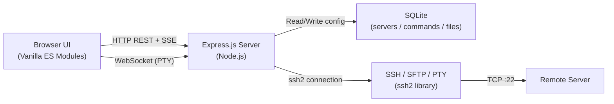
```mermaid
graph LR
    Browser["Browser UI\n(Vanilla ES Modules)"]
    Express["Express.js Server\n(Node.js)"]
    SQLite["SQLite\n(servers / commands / files)"]
    SSH["SSH / SFTP / PTY\n(ssh2 library)"]
    Remote["Remote Server"]

    Browser -- "HTTP REST + SSE" --> Express
    Browser -- "WebSocket (PTY)" --> Express
    Express -- "Read/Write config" --> SQLite
    Express -- "ssh2 connection" --> SSH
    SSH -- "TCP :22" --> Remote
```

- **Browser → Express**: REST API for CRUD operations; Server-Sent Events for streaming command output; WebSocket for interactive PTY.
- **Express → SSH**: The `ssh2` library manages connections, SFTP channels, and PTY allocation.
- **SQLite**: Stores server configurations (encrypted credentials), saved commands, and bookmarked file paths via `better-sqlite3`.
- **Encryption**: Credentials are encrypted with AES-256-GCM before being written to the database.

---

## Getting Started

### Prerequisites
- Node.js 18 or later
- An SSH server to connect to

### Installation

```bash
# Clone the repository
git clone <repo-url>
cd reconnect

# Install dependencies
npm install

# (Optional) Set an application password
echo "APP_PASSWORD=your-secret" > .env

# Start the server
npm start
# → Listening on http://127.0.0.1:3456
```

### First Run

Open `http://127.0.0.1:3456` in your browser.

> **Development tip**: If `APP_PASSWORD` is **not** set in your `.env` (or environment), the application **skips the login screen entirely** and loads the main UI directly. This makes local development frictionless — just `npm start` and go. Set `APP_PASSWORD` before exposing the app to any network.

---

## Feature Walkthrough

### 1 — Login

| Desktop | Mobile |
|---------|--------|
| 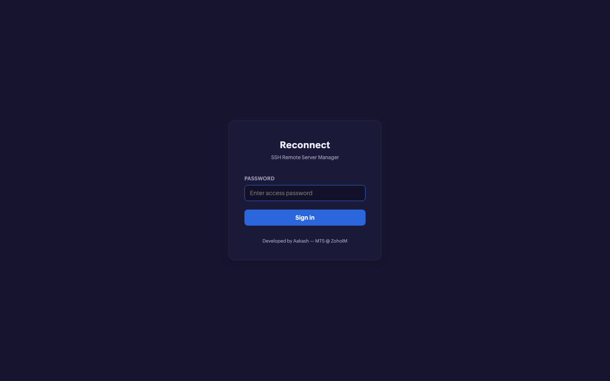 | 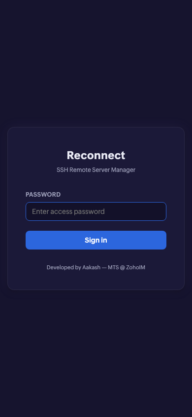 |

If you have configured `APP_PASSWORD`, Reconnect shows a simple login form on first visit. Enter the password and click **Login** to reach the main UI. The session is cookie-based and automatically validated on every request.

> **No `APP_PASSWORD` set?** The login screen is bypassed automatically and the app shell loads directly — ideal for local development.

---

### 2 — App Shell & Sidebar

| Desktop | Mobile |
|---------|--------|
| 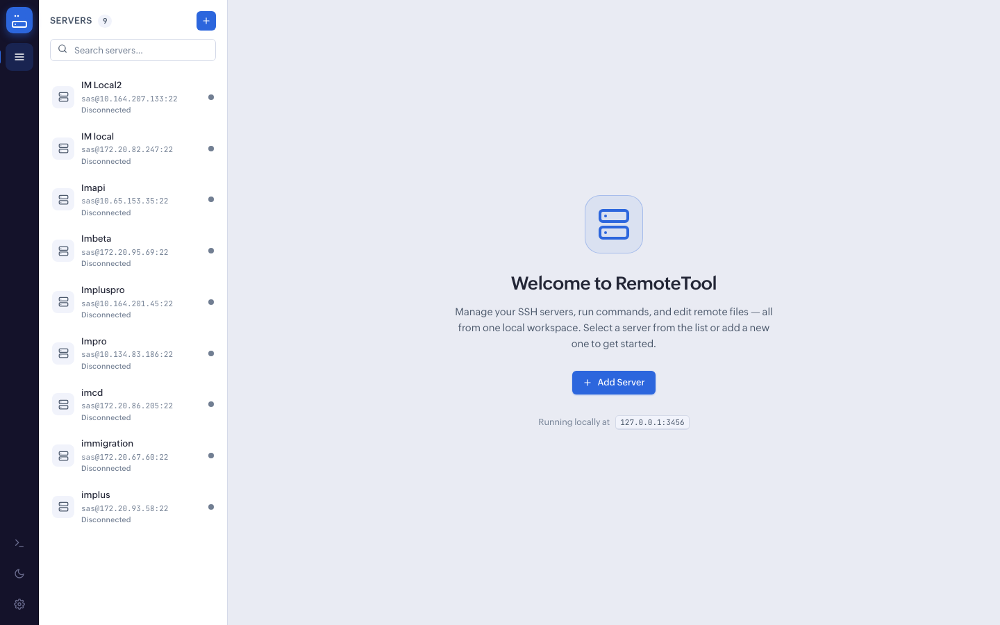 | 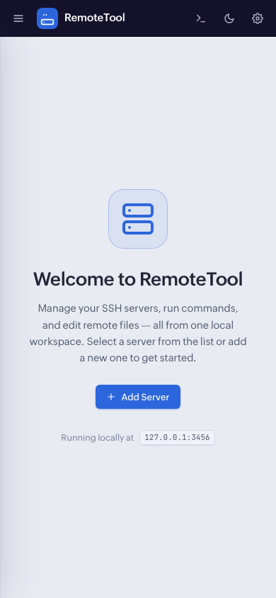 |

The main shell consists of:
- **Left rail** — icon strip with buttons for Settings, theme toggle, and (in connected state) tab navigation.
- **Sidebar** — scrollable list of all saved SSH servers. Each server shows its label, host, and a live status dot once connected.
- **Main panel** — content area that renders Overview, Terminal, or Files depending on the active tab.

On mobile, the sidebar collapses behind a menu toggle and a bottom navigation bar handles tab switching.

---

### 3 — Managing Servers (Add / Edit / Delete)

| Desktop | Mobile |
|---------|--------|
| 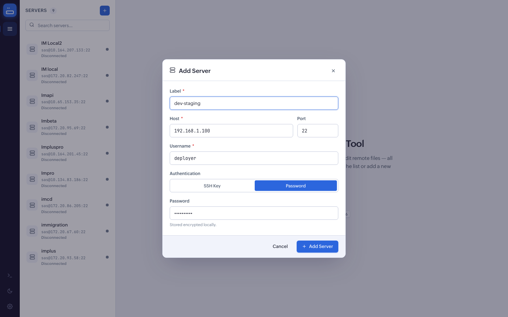 | 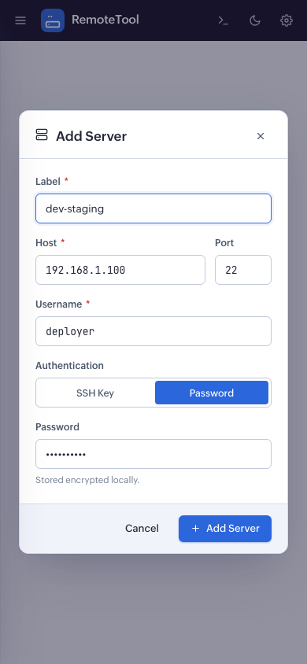 |

Click the **＋** button in the sidebar header to open the **Add Server** modal. Fill in:

| Field | Description |
|---|---|
| Label | Friendly display name |
| Host | IP address or hostname |
| Port | Default `22` |
| Username | SSH login user |
| Auth mode | Password / Private key / OTP |

Switch between auth tabs to reveal the relevant credential field. Click **Save** to persist the server (credentials are encrypted with AES-256-GCM).

| Desktop | Mobile |
|---------|--------|
| 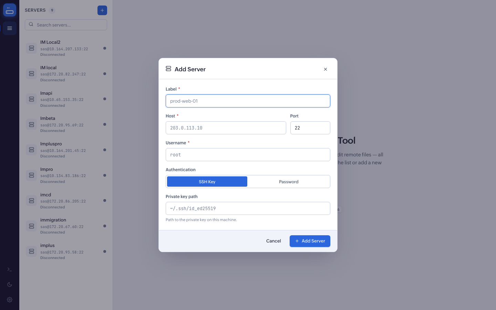 | 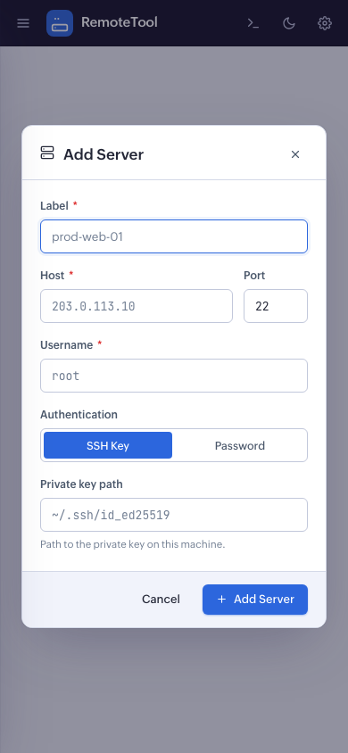 |

To **edit** an existing server, hover its row and click the pencil icon — the same form opens pre-populated. Delete via the trash icon with a confirmation prompt.

---

### 4 — Settings

| Desktop | Mobile |
|---------|--------|
| 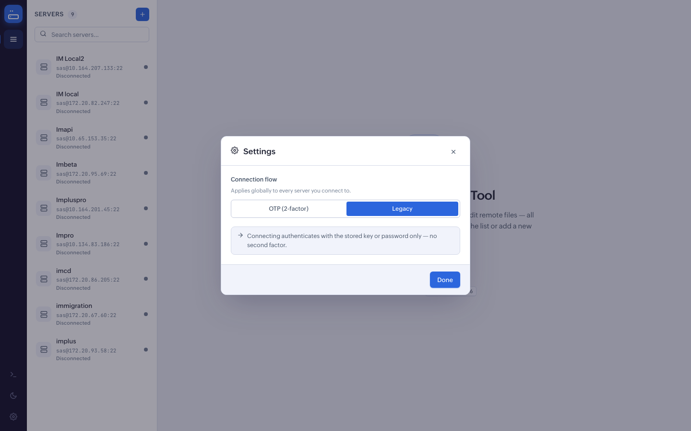 | 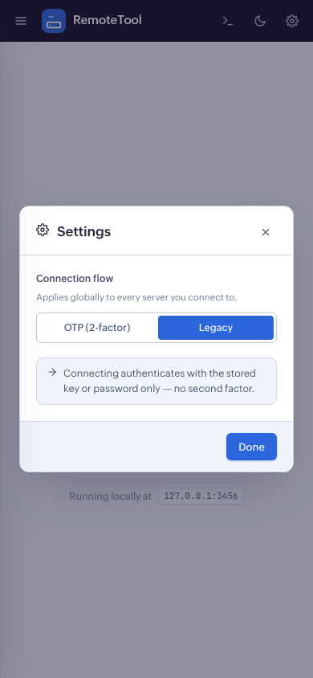 |

Open Settings via the **⚙** icon in the rail. From here you can:
- Switch the global authentication mode between **Legacy (password)** and **OTP** for all new servers.
- Manage the application-level login password (`APP_PASSWORD`).

---

### 5 — Server Overview: Before & After Connection

Reconnect distinguishes between a **selected** server (just clicked in the sidebar) and a **connected** server (active SSH session established).

#### Before Connection (Disconnected State)

| Desktop | Mobile |
|---------|--------|
| 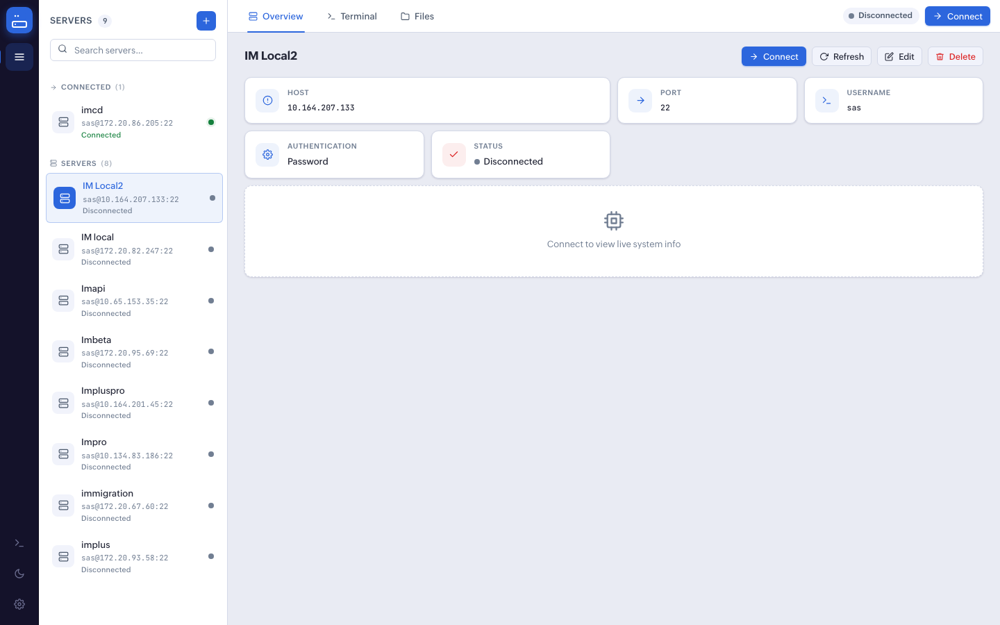 | 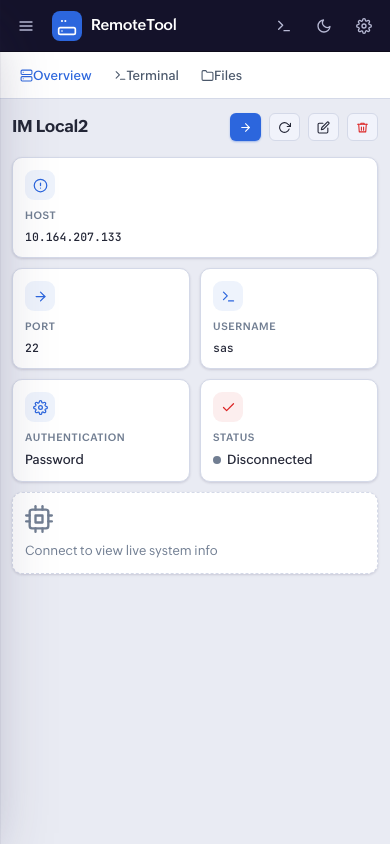 |

When you first select a server, the Overview tab shows the server details with a **Connect** button. No live stats are visible yet — the SSH connection hasn't been established.

#### After Connection (Live Stats)

| Desktop | Mobile |
|---------|--------|
| 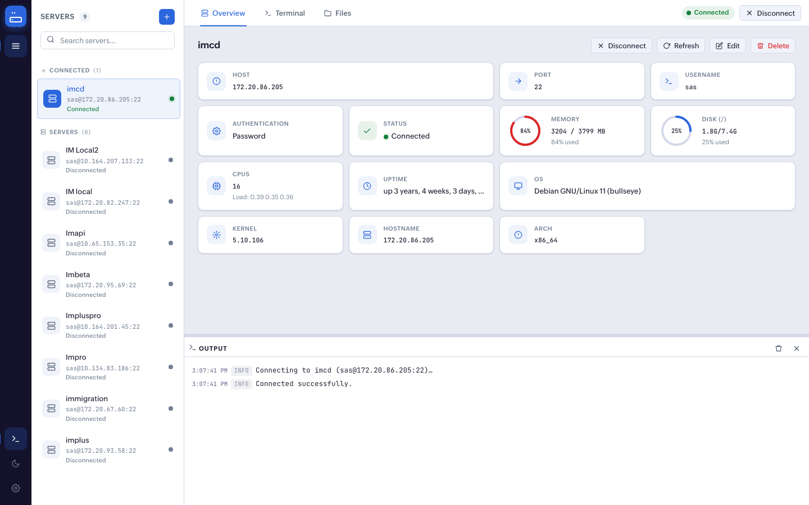 | 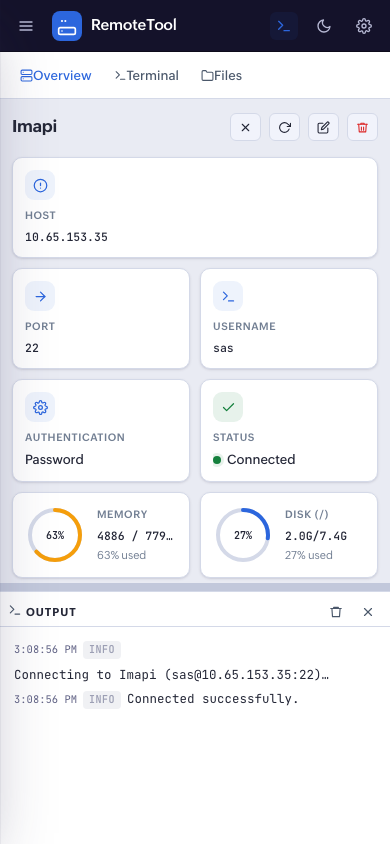 |

Click **Connect** (or the connect button in the toolbar). Reconnect establishes the SSH session and the bento dashboard lights up with live data:

- **Status pill** — green Connected indicator.
- **Hostname & OS** — distribution, kernel version.
- **Uptime** — human-readable running time.
- **CPU** — model and current load percentage.
- **Load Average** — 1 / 5 / 15-minute averages.
- **Memory** — used / total with a progress bar.
- **Disk** — root partition usage with a progress bar.

Stats refresh automatically on connection; no manual polling needed.

---

### 6 — Interactive Terminal

#### Connected State

| Desktop | Mobile |
|---------|--------|
| 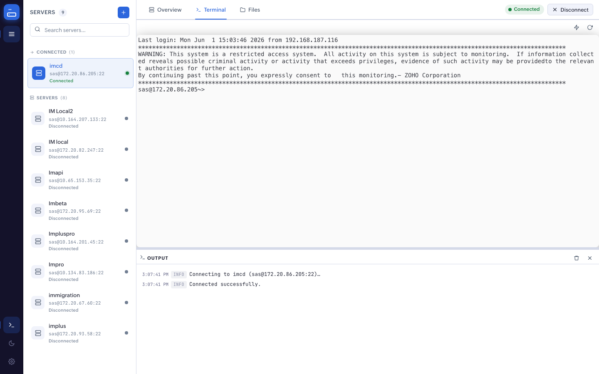 | 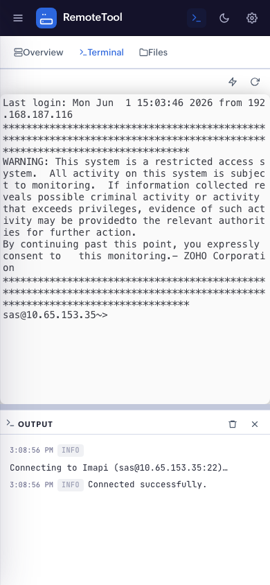 |

The **Terminal** tab opens a full PTY session via WebSocket once connected. Features:
- Colour rendering, cursor control, and scrollback buffer.
- Automatic resize when the panel size changes.
- Keyboard shortcuts pass through to the remote shell (Ctrl-C, Ctrl-Z, tab completion, etc.).
- Right-click context menu for copy/paste.

#### Running a Command

| Desktop | Mobile |
|---------|--------|
| 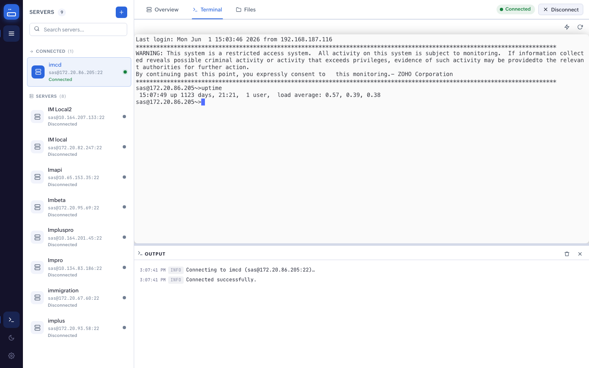 | 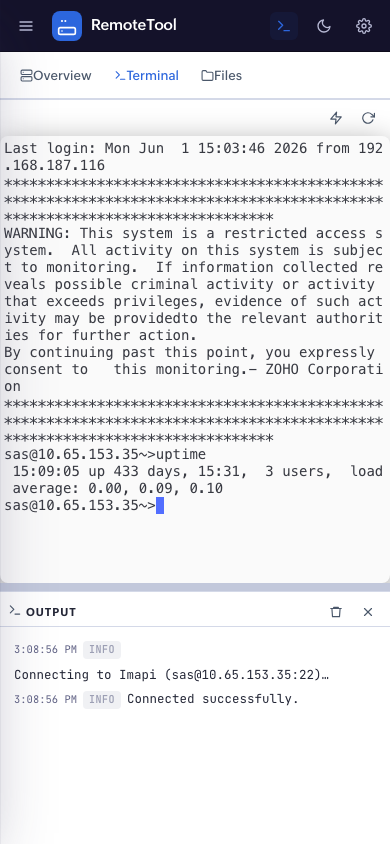 |

Type any shell command directly in the terminal and press **Enter**. The output streams back in real time through the WebSocket PTY — exactly as if you were using a native SSH client. The screenshot above shows `uptime` returning live server data.

---

### 7 — Quick Commands Drawer

| Desktop | Mobile |
|---------|--------|
| 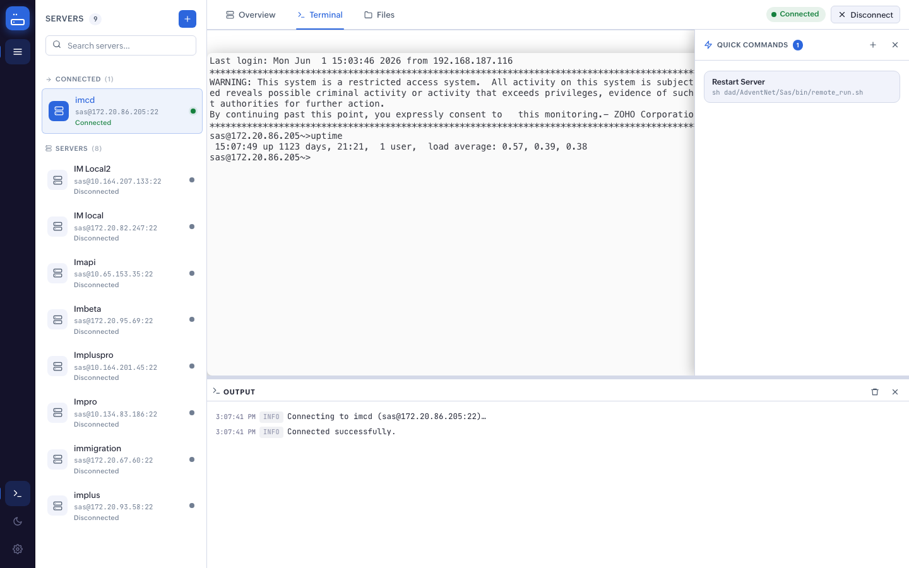 | 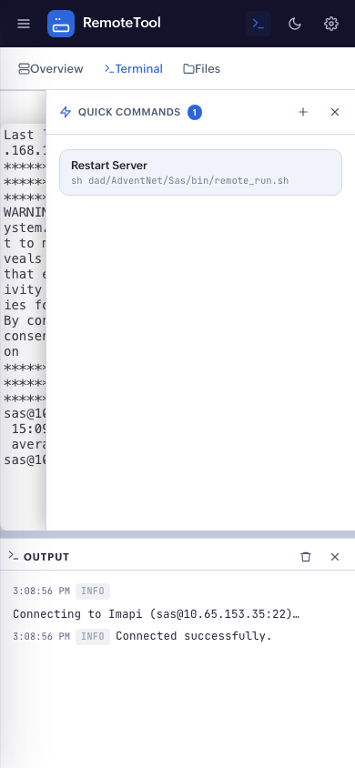 |

Click the **⚡ Quick Commands** button in the terminal toolbar to open the drawer. Saved commands are listed with their labels. Click any row to inject the command into the active terminal and execute it immediately — no typing required.

To **add** a new quick command, use the inline form at the bottom of the drawer; to **delete**, click the × on any row. Commands are stored in SQLite and persist across sessions.

---

### 8 — Resizable Output / Log Panel

| Desktop | Mobile |
|---------|--------|
| 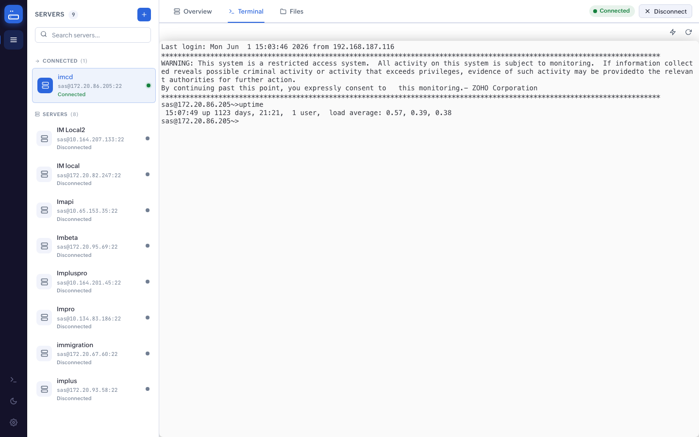 | 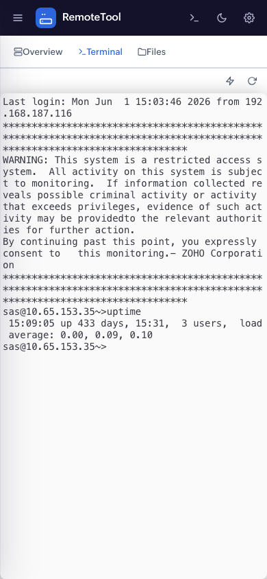 |

The terminal and output panel share a vertical split. Drag the **divider handle** between them to resize either region. Reconnect saves your preferred ratio in `localStorage` so it persists across page reloads.

The output panel is also used for streaming ad-hoc command results via Server-Sent Events — keeping one-off command output separate from your interactive PTY session.

---

### 9 — Remote File Browser

| Desktop | Mobile |
|---------|--------|
|  | 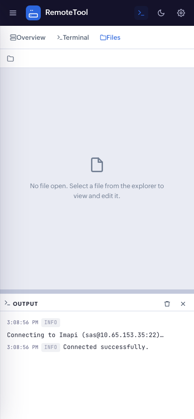 |

The **Files** tab shows a tree-style directory listing of the remote server via SFTP. Navigate by:
- Clicking any **folder** row to expand/collapse it.
- Using the **breadcrumb bar** at the top to jump to any ancestor directory.
- Clicking the **pencil icon** next to the path to type a path directly and press Enter to navigate there.
- Clicking the **🔄 refresh** button to re-fetch the current directory.

---

### 10 — Viewing a File

| Desktop | Mobile |
|---------|--------|
| 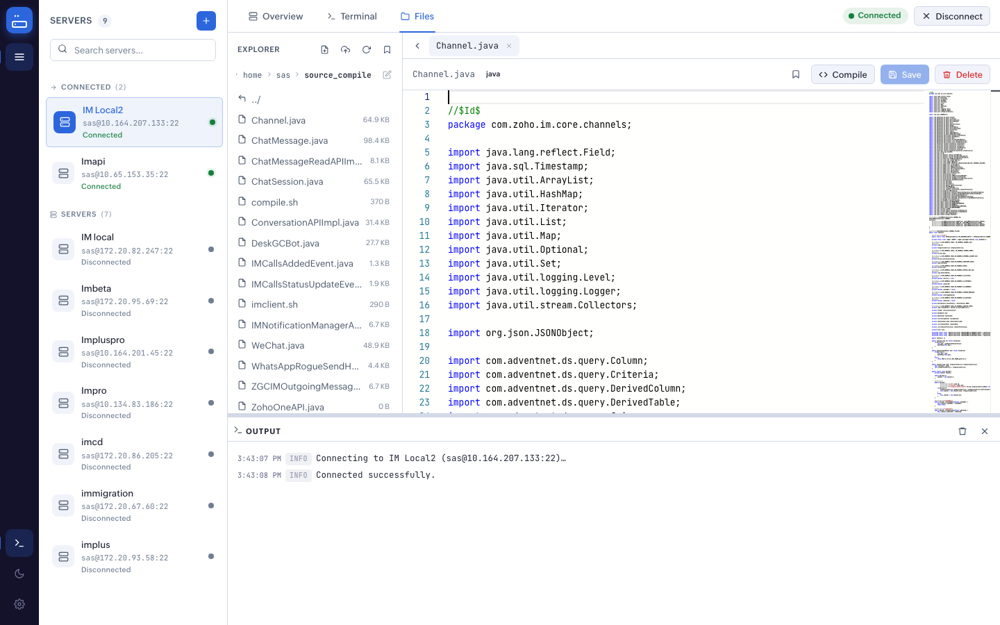 | 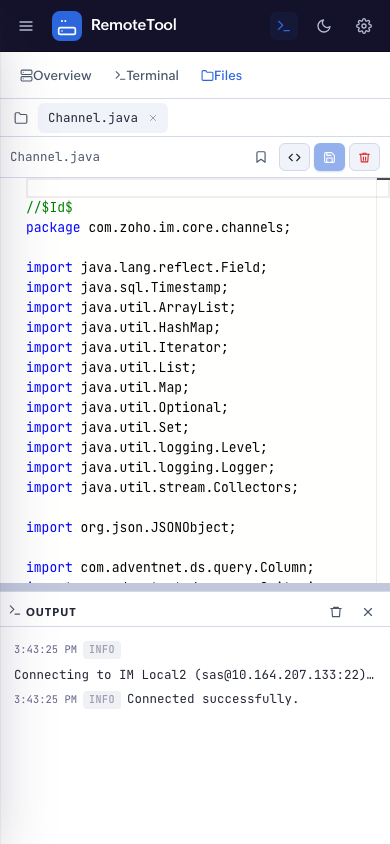 |

Click any **file** row in the tree to open it in the embedded **Monaco editor** (the same engine that powers VS Code). Features:
- Syntax highlighting for hundreds of languages (auto-detected from file extension).
- Find / replace, multi-cursor, bracket matching.
- **Save to Remote** button writes the current buffer back to the server via SFTP.
- **Download** button saves a local copy without touching the remote file.
- **Compile** button runs `sh compile.sh <filename>` in the `source_compile` directory on the remote server and streams the build output directly to the output panel.

> **Note:** Compile should be done after saving, and only when new changes have been applied.

---

### 11 — Creating a New File

| Desktop | Mobile |
|---------|--------|
| 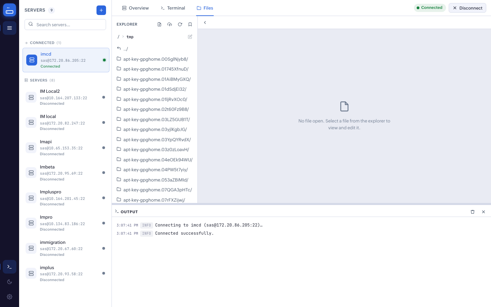 |  |

Click the **+ New File** button in the Files toolbar. A prompt asks for the filename; the new file is created in the **current directory** shown in the path bar and opens immediately in Monaco for editing. Press **Save** to write the initial content to the remote server via SFTP.

---

### 12 — Deleting a File

| Desktop | Mobile |
|---------|--------|
| 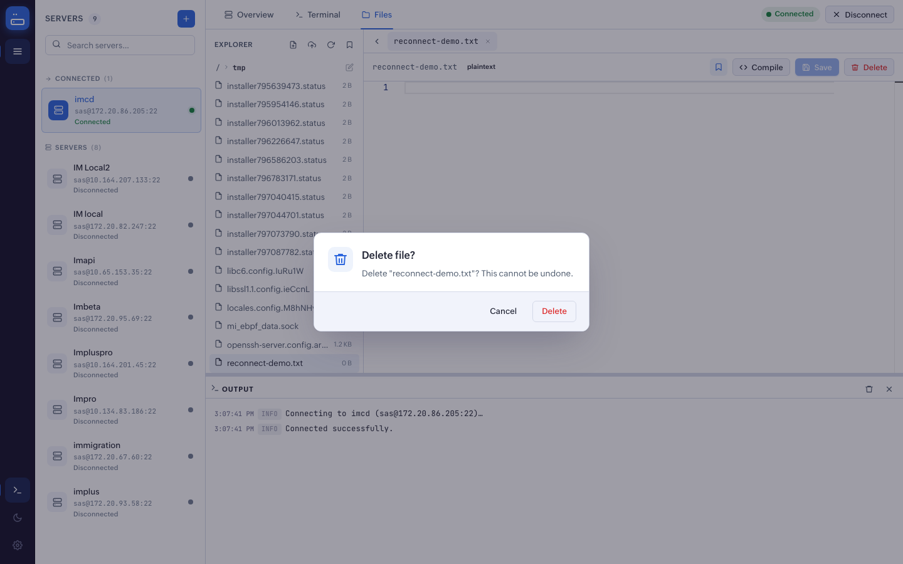 | 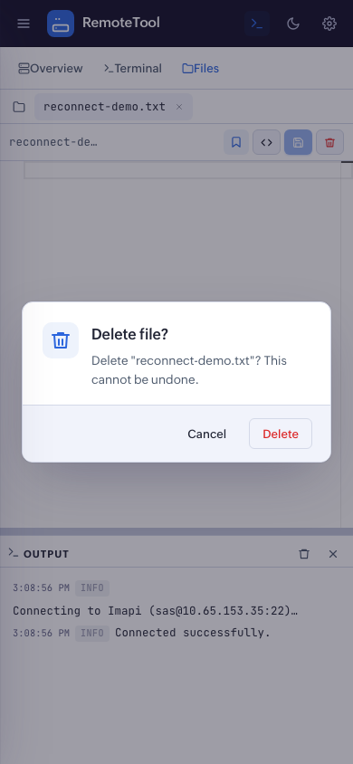 |

With a file open in Monaco, click the **🗑 Delete** button in the toolbar. A confirmation modal appears before any action is taken — click **OK** to permanently remove the file from the remote server, or **Cancel** to abort. After deletion, the file tree automatically refreshes.

---

### 13 — Upload a File

| Desktop | Mobile |
|---------|--------|
| 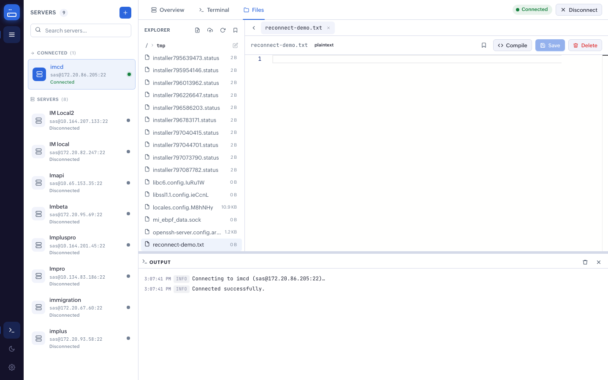 | 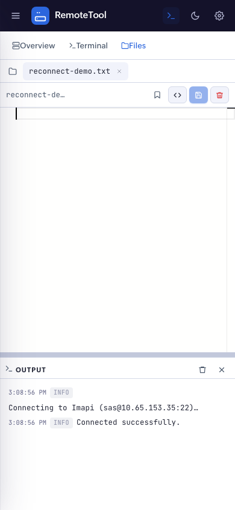 |

Click the **↑ Upload** button in the Files toolbar to open a native file picker. Select a local file; Reconnect uploads it to the **current directory** shown in the path bar via SFTP. No temporary files are created server-side; the upload streams directly to the destination path.

---

### 14 — Bookmarks

| Desktop | Mobile |
|---------|--------|
| 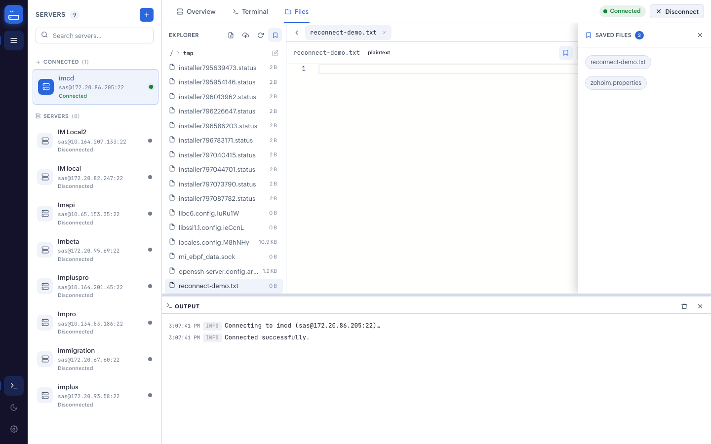 | 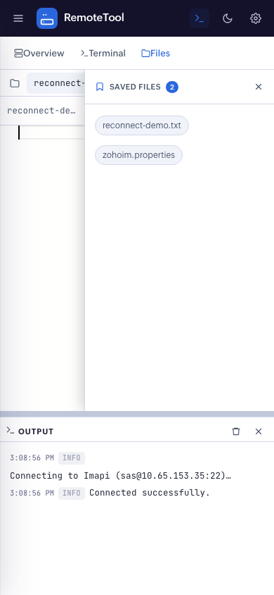 |

With any file or directory open, click the **🔖 Bookmark** button to save the path. Open the **Bookmarks drawer** (toggle button in the Files toolbar) to see all saved paths as chips. Click any chip to navigate directly to that path in the file tree — ideal for deep config directories you access repeatedly.

Bookmarks are stored in SQLite and persist across sessions. Click the **×** on a chip to remove a bookmark.

---

### 15 — Theme Toggle

**Dark mode** (default):

| Desktop | Mobile |
|---------|--------|
| 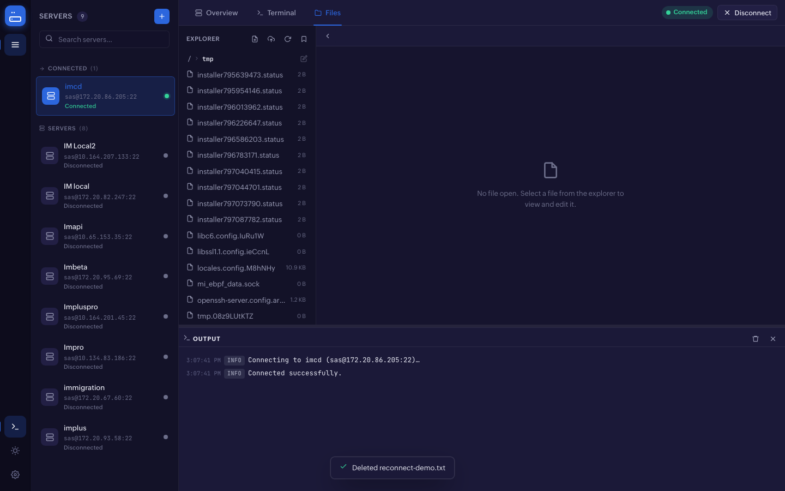 | 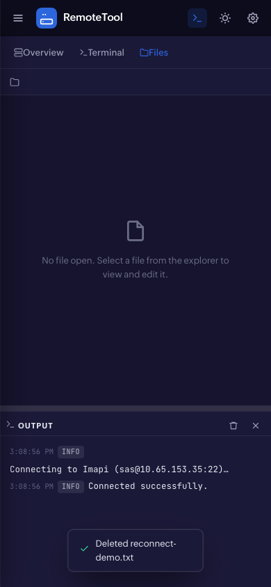 |

**Light mode**:

| Desktop | Mobile |
|---------|--------|
| 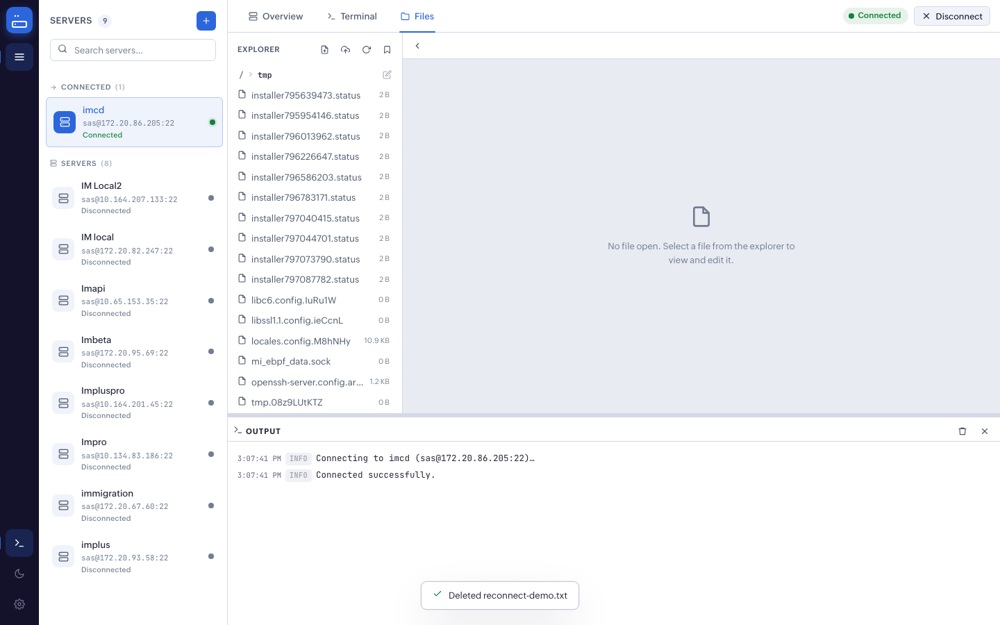 | 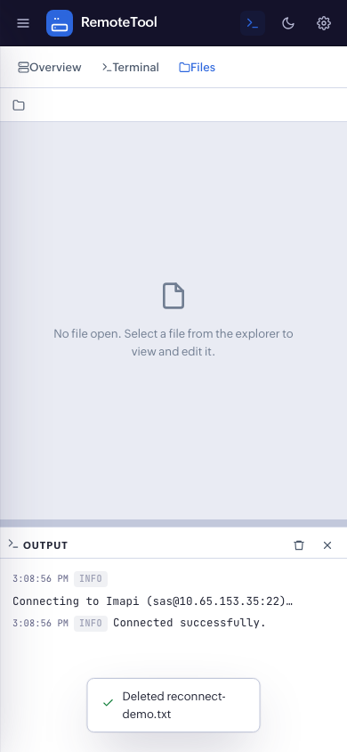 |

Click the **🌙 / ☀** icon in the left rail to switch themes instantly. The preference is stored in `localStorage` and persists across page reloads.

---

### 16 — Responsive Design

Every feature shown above has been tested at both **1440 × 900 px** (desktop) and **390 × 844 px** (iPhone 14 equivalent). Reconnect adapts with:

- **Collapsible sidebar** — on narrow viewports the server list slides in from the left via a menu toggle.
- **Bottom navigation bar** — replaces the left rail for Overview / Terminal / Files tab switching on mobile.
- **Reflowing panels** — modals, the file tree, Monaco editor, and output panels all reflow to fill available width.
- **Touch-friendly targets** — buttons and rows use generous tap areas for reliable touch interaction.

All mobile screenshots in this document were captured at 390 × 844 px with a Mobile Safari user-agent.

---

## Security Notes

| Concern | How Reconnect addresses it |
|---|---|
| Credential storage | SSH passwords and private keys are encrypted with **AES-256-GCM** before being written to SQLite. The encryption key is derived from a `.secret` file generated on first run. |
| Application access | Protected by `APP_PASSWORD`; all routes check a signed session cookie. In development, omitting `APP_PASSWORD` bypasses the login screen for convenience. |
| Network exposure | Server binds to `127.0.0.1` by default — not reachable from other machines unless you explicitly change `HOST`. |
| Session management | Sessions are signed with a random key; tampering with the cookie invalidates it immediately. |
| SFTP operations | File reads and writes go through the SSH connection — no additional ports need to be opened. |

---

*Documentation generated from a live Reconnect instance at `http://127.0.0.1:3456/` connected to the Imapi SSH server. A throwaway file `/tmp/reconnect-demo.txt` was created and deleted during documentation generation to demonstrate file CRUD and bookmarking; no production data was touched.*
