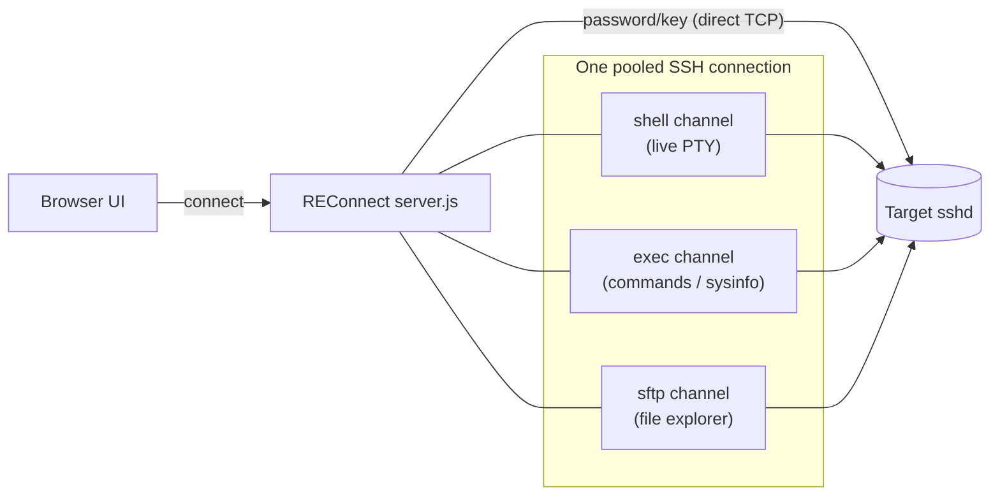
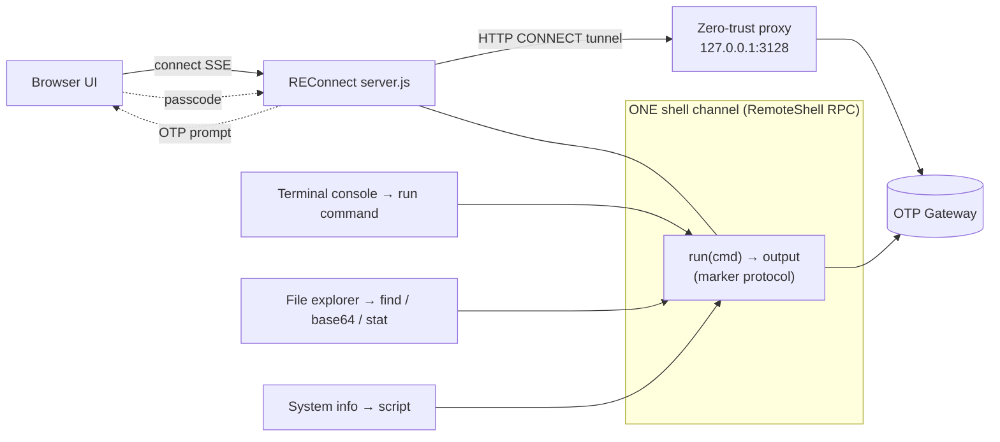
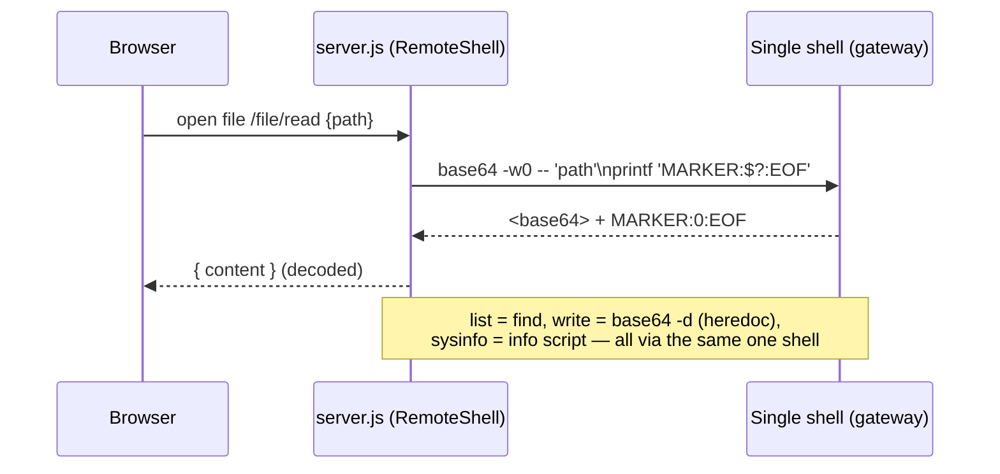

# REConnect — Terminal & File Access: Password vs OTP Flow

> How the **Terminal** and **File Explorer** work under the two authentication
> modes, why they had to be built differently, how the OTP limitation was solved,
> and the trade-offs of that solution.

---

## TL;DR

| | **Password / Key (Legacy)** | **OTP (Zero‑Trust)** |
|---|---|---|
| Network path | Direct TCP to host | Through a **zero‑trust HTTP proxy** (`127.0.0.1:3128`) |
| Auth | Stored password/key (silent) | **One‑time passcode** typed by the user |
| SSH channels allowed | **Many** (normal sshd) | **Exactly one**, shell‑only |
| Terminal | Live PTY shell (real terminal) | **Command console** (run → output) |
| File Explorer | **SFTP** | Files moved as **base64 over the shell** |
| System info / commands | `exec` channel | Run over the shared shell |

**One line:** A normal server lets us open many SSH "channels" over one
connection, so terminal, files, and info each get their own. The org's zero‑trust
gateway allows **only a single interactive shell per login** — so we drive
*everything* (terminal, files, info) through that one shell.

---

## 1. Background — what an "SSH channel" is

A single SSH connection can carry multiple independent **channels**, each used
for a different job:

- **`shell`** → an interactive terminal (a PTY: supports vim, colors, arrow keys)
- **`exec`** → run one command and capture its output
- **`sftp`** → a file‑transfer subsystem (list/read/write/upload/download)

REConnect keeps **one pooled SSH connection per server** and normally opens as
many channels on it as it needs. That assumption is what breaks under OTP.

---

## 2. Password / Key (Legacy) flow

Everything is straightforward because the target is a normal OpenSSH server that
allows multiple channels.

**How each feature is served (legacy):**

| Feature | Mechanism | Code path |
|---|---|---|
| Terminal | `conn.shell()` → live PTY over a **WebSocket** | `wss /api/servers/:id/shell` → xterm/WTerm |
| File Explorer | `conn.sftp()` per operation | `/api/servers/:id/file/{list,read,write,delete}`, `/upload` |
| System info / Run command | `conn.exec()` | `/api/servers/:id/sysinfo`, `/api/servers/:id/exec` |
| Auth | Stored password (or key); keyboard‑interactive auto‑answered | `sshConfig(server, 'legacy')` |

Result: a **real terminal** (vim, htop, colors all work) and a **real SFTP file
browser**, because the server happily multiplexes channels.

---

## 3. OTP (Zero‑Trust) flow

The org routes SSH through a zero‑trust gateway. Two hard limits change everything:

> **Gateway limit 1 — one channel per login.** A second channel is refused
> (`Session open refused by peer`).
>
> **Gateway limit 2 — interactive shell only.** `exec` is refused
> (`exec request failed on channel 0`); the `sftp` subsystem is likewise refused.

So we **open the one allowed shell once** and turn it into a general‑purpose
command channel ("shell‑RPC"). Terminal, files, and info all ride that single shell.

**How each feature is served (OTP):**

| Feature | Mechanism | Code path |
|---|---|---|
| Terminal | **Command console** (DOM): each command → `run()` over the shared shell | `/api/servers/:id/exec` → `RemoteShell.run()` |
| File Explorer | Shell commands over the shared shell: `find` (list), `base64` (read/write), `stat`, `rm` | `/file/*`, `/upload` → `RemoteShell.list/readFile/writeFile/deletePath` |
| System info | Same info script via `run()` | `/api/servers/:id/sysinfo` |
| Auth | **OTP typed by user**; ssh2 forced to `keyboard-interactive` | `sshConfig(server, 'otp')` + OTP modal |
| Reachability | **HTTP CONNECT tunnel** through the proxy | `connectViaProxy()` → `config.sock` |

---

## 3b. The zero-trust gateway (authoritative architecture)

The single-shell, shell-only behavior we worked around is **not an accident or a
quirk of one server** — it's the documented design of the org's **ZAC
certificate-based, password-less zero-trust** access path. This is the official
reason behind every OTP-mode design choice in this app.

**Components:**

| Component | Role |
|---|---|
| **0Agent** | Client-side process on your machine; intercepts SSH traffic and tunnels it to a ServiceEdge. |
| **ServiceEdge** | Internet-facing proxy; forwards tunnelled traffic to the right AppConnector. |
| **AppConnector** | Proxy inside the DC; enforces access policy, prompts for OTP, requests the cert, and proxies the session. |
| **ZAC** | Signs short-lived SSH certificates and holds the DC's ZService inventory. |
| **0Trust App-Server** | Control plane: models ZServices into applications and maps people-departments to them. |
| **Target SSH server** | The real destination; trusts the ZAC CA (`TrustedUserCAKeys`). |

**The cert-based SSH flow (6 phases):**

1. **Tunnel** — `0Agent` intercepts your `ssh` and tunnels to a `ServiceEdge`, which routes to the destination DC's `AppConnector`.
2. **Scoping + OTP** — the AppConnector checks your department against the application's allowed departments, then prompts for an **OTP** (validates the human).
3. **Cert generation** — on OTP success, the AppConnector gets a short-lived **Ed25519 cert** signed by ZAC (cached per user+service until expiry; never leaves the AppConnector).
4. **Session to target** — the AppConnector opens a cert-authenticated SSH session to the target (validated against the ZAC CA).
5. **Restricted proxying** — deep SSH protocol filtering allows **only an interactive shell** and blocks **SCP, SFTP, port forwarding, Unix-socket forwarding, X11 forwarding, agent forwarding** — at the gateway, even if enabled on the target.
6. **Session end** — on exit, all layers clean up; the cached cert remains until expiry.

**This is exactly why REConnect's OTP mode is built the way it is:**
- *"Only an interactive shell"* + *"one session channel"* → we open **one shell** and multiplex everything over it (the shell-RPC below).
- *"SFTP/SCP blocked"* → the file browser can't use SFTP; it runs shell commands + base64 instead.
- *"OTP validates the human"* → a passcode per login, no stored credential.

---

## 4. Why the difference exists

| Question | Legacy | OTP / Zero‑Trust |
|---|---|---|
| Is the host directly reachable? | Yes | **No** — only via the proxy; the IP is a zero‑trust overlay address |
| How many SSH channels? | Many | **One per login** |
| Which channel types are allowed? | shell + exec + sftp | **shell only** |
| Credentials | Stored, reused silently | **Fresh OTP per login** (emailed) |
| Can features run in parallel? | Yes (separate channels) | **Serialized** over one shell |

The gateway is a security boundary: it intentionally restricts the session to a
single interactive shell. REConnect's original design (many channels per
connection) is incompatible with that — hence a different approach for OTP.

---

## 5. How we solved it (OTP flow)

Three problems, three fixes:

**A. The host wasn't reachable.**
ssh2 was connecting *directly* and hitting the wrong machine. Fix: tunnel through
the same zero‑trust proxy the system `ssh` uses (`ProxyCommand … nc -X connect -x
127.0.0.1:3128`). We open an **HTTP CONNECT** tunnel and hand the socket to ssh2.

**B. Auth never reached the OTP prompt.**
ssh2 was trying a dead SSH‑agent first. Fix: force
`authHandler: ['keyboard-interactive']` so it goes straight to the OTP challenge,
which is surfaced to the user via the passcode modal.

**C. Terminal + files need multiple channels, but only one is allowed.**
Fix: a small **`RemoteShell`** class that turns the single shell into a
request/response channel. Each operation is a shell command whose output is
captured up to a unique random **marker**; file contents move as **base64**.

**Key properties of the shell‑RPC:**

- **Serialized queue** — one command at a time (no channel collisions).
- **Marker protocol** — `MARKER:<exit code>:EOF` reliably delimits each command's output.
- **Binary‑safe** — base64 in/out; large writes are line‑wrapped to survive the PTY's input limit.
- **Stateful** — it's one persistent shell, so `cd` and environment persist between commands (the console prompt even tracks the working directory).

---

## 6. File operation mapping

| Operation | Legacy (SFTP) | OTP (shell‑RPC) |
|---|---|---|
| List directory | `sftp.readdir` | `find -maxdepth 1 -printf …` |
| Read file | `sftp.createReadStream` | `base64 -w0 -- <file>` → decode |
| Write / Save | `sftp.createWriteStream` | `base64 -d > <file>` (heredoc) |
| Upload | stream to `sftp` | base64 → heredoc write |
| Delete | `sftp.unlink` | `rm -rf -- <path>` |
| System info | `exec` script | same script via `run()` |

The **frontend file explorer and editor are unchanged** — the same endpoints are
simply re‑implemented over the shell in OTP mode.

---

## 7. Pros & Cons of the OTP shell‑RPC approach

**Pros**

- ✅ Works within the zero‑trust policy — **one shell, one OTP**, no policy violation.
- ✅ Full **file explorer + editor** despite SFTP being blocked.
- ✅ **No extra OTPs** — every feature reuses the single authenticated shell.
- ✅ **Stateful** session — `cd`/env persist; the console feels like a shell.
- ✅ Frontend file/editor code and endpoints stay the same across both modes.
- ✅ No new dependencies (plain `net` + shell built‑ins: `find`, `base64`, `stat`).

**Cons / Limitations**

- ⚠️ **No live TTY in‑app** — no vim, htop, less, nano in the terminal; it's a
  command console (run → output). Use real `ssh` for full‑screen programs.
- ⚠️ **Serialized** — operations run one at a time (fine for a single user, not
  built for heavy concurrency).
- ⚠️ **File size practically capped** — base64 over a shell is slower and heavier
  than SFTP; very large/binary transfers are constrained (sane caps applied).
- ⚠️ **Depends on remote tooling** — assumes GNU `coreutils` (`base64 -w0`,
  `find -printf`, `stat -c`) on the target.
- ⚠️ **Tighter coupling to gateway behavior** — relies on the proxy address and
  the gateway granting a usable interactive shell.

---

## 8. Quick reference

| Concern | Legacy | OTP |
|---|---|---|
| Connect | `ensureSession()` (direct) | SSE `/connect` + `connectViaProxy()` |
| Auth config | `sshConfig(server,'legacy')` | `sshConfig(server,'otp')` (forced keyboard‑interactive) |
| Terminal | WebSocket PTY (`conn.shell`) | DOM command console (`/exec` → `run()`) |
| Files | `conn.sftp()` | `RemoteShell.list/readFile/writeFile/deletePath` |
| Channels used | many | one (shared) |
| Best for | full interactive use | gated/zero‑trust hosts, editor‑style workflow |

*All OTP‑mode logic lives in `server.js` (`RemoteShell`, `connectViaProxy`,
`sshConfig`, the `/connect` SSE handler) and `public/js/features/terminal.js`
(the command console). Legacy behavior is unchanged.*
